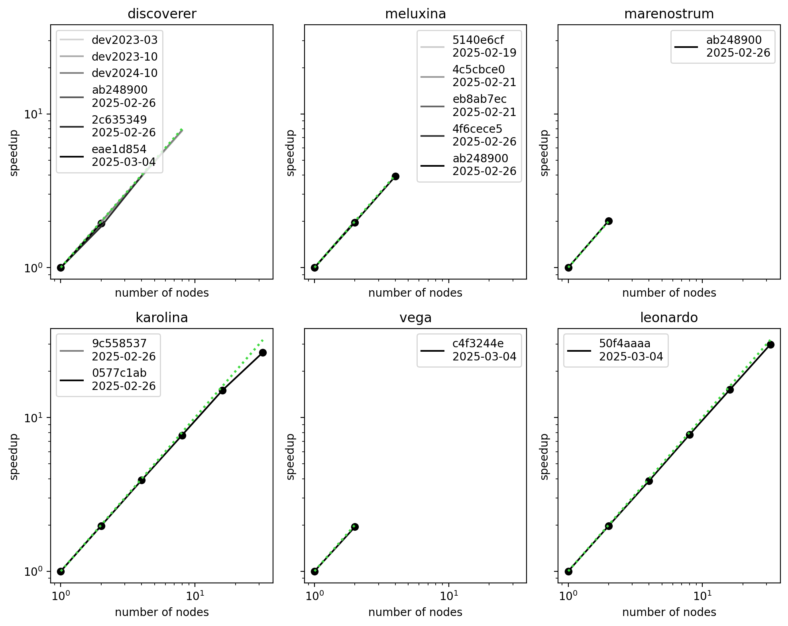
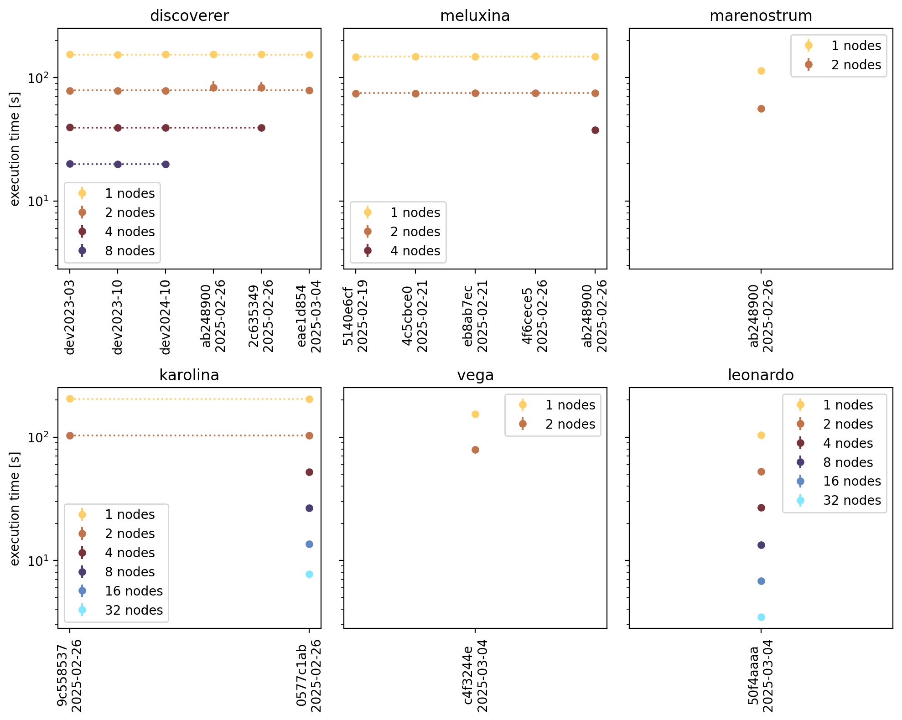

# Benchmarks

As of 2025, we continuously assess the performance of RAMSES on various supercomputers, for a selection of typical setups. The scripts to do so have been developed in the context of the SPACE CoE project. The scripts, setups and results can be found in the `benchmarks` directory included in the RAMSES code repository.

## How to use the benchmark script
The benchmark script works similar to the test suite script.
To run all benchmarks on one of the predefined clusters,
go to the benchmark directory and execute the command
```
./launch_benchmark_suite.sh -c cluster_name
```
where you replace `cluster_name` by the name of the computing cluster you are currently on. To see which clusters are supported, check the subdirectory `benchmarks/HPCclusters`.

By default, this will execute all benchmarks defined in the `benchmarks/setups` subdirectory. To launch a specific benchmark, use the command line argument `-t`. For example, to run only the sedov test on the MeluXina cluster:
```
./launch_benchmark_suite.sh -c meluxina -t 2
```

The script is going to create and submit job scripts to run all the benchmarks simulations on  different number of nodes. By default, 1, 2, 4, 8 and 16 nodes are used. The maximum number of nodes can be set using the command line agrument `-n`, for example `-n 4` will modify the behaviour to launch only on 1, 2 and 4 nodes. For each configuration, a number of identical jobs will be launched to get more statistics on the execution time and detect outliers. By default, each run is repeated 3 times.
To also execute the benchmark setups with different resolutions to obtain weak scaling data, add the command line flag `-w`.

After launching all jobs for a benchmark case, an additional dependency job is launched to gather the resulting timings from the log files. The are then stored in text files in the `benchmarks/results` subdirectory. There is a file for each combination of cluster and setup. Inside a file, one line contains one data entry, for example:
```
2025-02-27,ebcb6769,1024,1,[155.512386617 153.174278465 155.66211]
```
In order, we have the execution date of the benchmark, the commit hash, the resolution of the setup, the number of nodes used, and finally a list with the total execution times.
Visualizing this data can be done using the `analyse_benchmark.py` script, which produces figures like the ones in the next section.

TODO how to deal with commits to save benchmark results?
Seperate bench to collect them?

## Overview of the performance of RAMSES

Strong scaling for the sedov test on the EuroHPC systems


Evolution of the execution time for the sedov test on the EuroHPC systems



## List of benchmark setups

Here we give an overview of the different benchmark setups

### sedov
This is a classic Sedov-blast test. This test is standard and used in most of the regular tests and benchmarks of astrophysics gas dynamics codes. The use-case is run in 3D with a uniform grid in order to focus on the three selected regions, without any overhead due to adaptive mesh refinement. The physical setup consists in a uniform density and pressure medium at rest (zero velocity) in which an internal energy pulse is put in the corners of the computational domain. The internal energy is then progressively converted into kinetic energy via total energy conservation.
This test is purely hydrodynamical. It enables to test the performances of the hydrodynamical kernel and of the communication kernels of RAMSES without the overheads due to the AMR. We use a uniform grid at level l and the Lax-Friedrich Riemann solver. There is no load balancing done after the initialization of the simulation run. In this use-case all time steps (or iterations) are equivalent in terms of computational cost. We run for 10 time steps. This scientific case is well-suited for memory bound runs, as well as to work on the optimization of the communications between MPI domains.


### cosmo
A cosmological volume represents a statistically accurate description of a patch of the Universe, in terms of the number density of dark matter halos as well as their spatial and mass distribution. To first order, this is achieved with realistic gravitational dynamics of DM and initial conditions that are statistically identical to the observed power spectrum of density and temperature fluctuations in the cosmic microwave background, which collapse to form the so-called cosmic web. The fact that these ingredients can reproduce a realistic Universe more than 13 billion years later is among the greatest achievement of cosmological simulations and has made them an essential component in theoretical studies of structure formation from inter-galactic scales to the inter-stellar medium.

For the initial conditions we use the publicly available MUSIC software package, which is commonly used for most cosmological codes. MUSIC takes as parameters the co-moving width of the square volume, Lbox, the number of dark matter (DM) particles in each dimension, Npart, such that the total number of particles, and coarse-grid cells, is Npart^3, and the cosmological parameters representing the Hubble constant, the amplitude of the power spectrum on a scale of 8 Mpc, the matter fraction of the Universe, its dark energy fraction, and baryonic fraction. Additionally, one provides to MUSIC a random number seed for the generation of density fluctuations, i.e. by changing only the random seed one can produce multiple "instances" of a Universe with exactly the same cosmological properties.

Typically a cosmological simulation is run for more than 13 billion years, starting a few tens of Myrs after the Big Bang and finishing at the present epoch, where we have the largest wealth of observations to compare to theory. However, this is too expensive for running scaling tests, so we restrict ourselves here to running only the first ten time-steps, starting at redshift 150 when the Universe has almost no structure.

The cosmological runs we use for this science case contain only dark matter particles, i.e. no hydrodynamics, gas cooling, or star formation. Our justification for this is that these additional physics can make the exact comparisons between different resolutions somewhat tricky -- for example, stars may form at different times and at different rates, depending on the resolution, making the amount of computation very uneven between different resolution runs -- and additionally only a few initial time-steps are run, hence there really is no time anyway for structures to form and for this non-DM physics to become relevant. For the same reasons, we do not trigger adaptive mesh refinement.  These uniform-grid benchmarks hence mainly test the particle-in-cell algorithm, gravity, load balancing, and domain communication overheads.

We run tests with the same Lbox and initial conditions, only changing the resolution, i.e. Npart, by a factor of two, which changes the total number of particles and cells by a factor of 8. Given the same initial conditions, with a factor two increase of Npart, one should then expect to cover the same number of timesteps with a factor 8 increase in the computational load.

### galaxy
TODO


## How to add a new benchmark setup

Write a description of the setup and which parts of the code it benchmarks

TODO


## How to add a new computing cluster

The information specific to each computing cluster is stored in the directory `benchmarks/HPCclusters`. There is a subdirectory for each cluster. To add a new cluster, create a new subdirectory with the name of the cluster. Use only lower case characters.

Several files should be present:
* `cluster_info.sh`: a set of bash variables that describe the configuration of the cluster
* `compilation_modules.sh`: a list of commands that load the modules required to compile ramses
* `job_script_params.sh`: the parameters that should be set at the top of any job script

Other files are optional, and only need to be added if an exception applies to the cluster:
* 


### cluster_info.sh

There are some characteristics that need to be set for each cluster. Some can be retrieved automatically, others need to be set manually. This file contains all parameters that need to be set manually for all clusters. They are required for the operation of the benchmark launcher.
Here is an example for the Discoverer cluster:
```
# --- standard information (to be set for each cluster) ---

CLUSTER_SCHEDULER=SLURM
CLUSTER_SCRATCH=/discofs/$USER
CLUSTER_CORES_PER_NODE=128

COMPILER_FLAVOR=GNU
RUN_COMMAND=srun
MODULE_PYTHON=intel.universe
```

* `CLUSTER_SCHEDULER`: Which job scheduler is used? In most cases this will be SLURM.
* `CLUSTER_SCRATCH`: What is the path to the scratch directory, from which to launch jobs.
* `CLUSTER_CORES_PER_NODE`: The amount of cores on a node. Used to define the number of tasks per node.
* `COMPILER_FLAVOR`: Which compiler family to use. Used to select the compiler in the makefile. Currently supporting GNU and INTEL.
* `RUN_COMMAND`: The parallel run command used in the job script. Usually srun or mpirun.
* `MODULE_PYTHON`: The name of the python module. Used to load python before executing the python script which will gather the resulting timings.

### compilation_modules.sh

In this file, we store the commands that will load the modules needed to compile the code on the cluster. Currently, these provide a working combination but maybe not the most performant one. They should be updated when the software stack of the cluster evolves.

In most cases we only need to select which compiler and MPI library to use, as is for example the case on MeluXina:
```
module load GCC/13.3.0
module load OpenMPI/5.0.3-GCC-13.3.0
```
However, sometimes additional packages are required, as for example on Discoverer:
```
module load gmp/6
module load gcc/latest
module load openmpi/5/gcc/latest
```
Our chosen script architecture leaves freedom to load as many packages as needed.

### job_script_params.sh

The first part of this file define a set of required job script parameters specific to the cluster. Typically, this is where we set the cluster partition on which to launch jobs and the QoS. Doing this here allows to set a different partition or QoS depending on the number of nodes requested. For example, on Leonardo you can use only upto 16 nodes on the normal queue:
```
CLUSTER_QOS=normal
if [[ $NBNODES -gt 16 ]]; then
    CLUSTER_QOS=dcgp_qos_bprod
fi
```
The second part of this file contains a Here Document that will write the job script configuration to file. This type of bash construct allow to copy multiple lines of text, while filling in bash parameters. An example for the MareNostrum cluster:
```
cat <<JOBSCRIPT > "$OUTPUT_FILE"
#!/bin/bash -l
#SBATCH --job-name=${JOB_NAME}
#SBATCH --account=${CLUSTER_ALLOCATION_ID}
#SBATCH --partition=${CLUSTER_PARTITION}
#SBATCH --qos=${CLUSTER_QOS}
#SBATCH --nodes=${NBNODES}
#SBATCH --ntasks-per-node=${CLUSTER_CORES_PER_NODE}
#SBATCH --cpus-per-task=1
#SBATCH --threads-per-core=1
#SBATCH --exclusive
#SBATCH --time=${TEST_TIME}
#SBATCH --output=slurm_%j.out
#SBATCH --error=slurm_%j.err

export KMP_AFFINITY=\"granularity=fine,compact,1,0\"

JOBSCRIPT
```

As a marker for the Here Document, we chose the string JOBSCRIPT. The lines inbetween the markers will be written to a file with the name `$OUTPUT_FILE`, which is a bash variable specified in the benchmark launch script. Remark that if `$OUTPUT_FILE` exists, it will be overwritten (as indicated by the single >).

What is inbetween the two JOBSCRIPT markers, is the structure for any job script on this cluster.
A job script should start with `#!/bin/bash -l`. Be careful to NOT leave an empty line before this statement, as this will cause the system to not recognize the file as a job script!
Then, we specify the needed job script parameters, in this example indicated by `#SBATCH`. The bash parameters are filled in automatically when the benchmark launch script is calling this file. In addition to the variables you defined in the top of this file, use the variable names
* `JOB_NAME`
* `CLUSTER_ALLOCATION_ID`
* `NBNODES`
* `CLUSTER_CORES_PER_NODE`
* `TEST_TIME`
which have been set by the main benchmark script, the cluster info file and the test info file.

In addition, also add any export statements needed for the job to the Here Document. You may want to specify a binding strategy as done in this example. For more info in binding/pinning MPI and OpenMP threads, see XXX.
